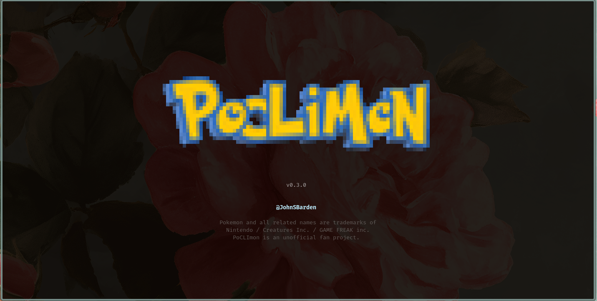
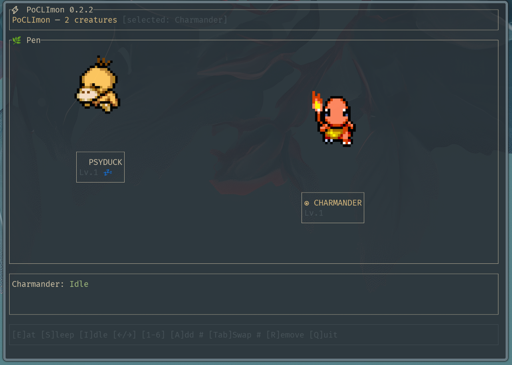

# PoCLImon



**Pokemon living in your terminal.** Eat, sleep, play. 🕹️

```
poclimon
```



---

## Features

- Animated sprite art in your terminal — Kitty, Sixel, iTerm2, and halfblock for the rest
- Up to 6 creatures sharing one open pen with elastic collision physics
- Feed, sleep, and idle animations
- Add, remove, and swap creatures live with no restart and no config editing
- Full Gen 1–9 Pokédex: any creature by name or National Dex ID, 898+ entries
- Sprites cached to `~/.config/poclimon/sprites/` — downloaded once, Bill's PC keeps the rest
- TOML config

---

## Installation

```bash
git clone https://github.com/JohnSBarden/poclimon.git
cd poclimon
cargo install --path .
```

Requires Rust + Cargo. If you don't have it, go to [rustup.rs](https://rustup.rs) — it's super effective.

---

## Usage

```bash
poclimon                           # loads ~/.config/poclimon.toml
poclimon --creature pikachu        # single creature, no config needed
poclimon --config ./my-roster.toml # custom config
```

---

## Controls

| Key         | Action                                                                    |
| ----------- | ------------------------------------------------------------------------- |
| `E`         | Feed selected creature                                                    |
| `S`         | Put selected creature to sleep                                            |
| `I`         | Return to idle                                                            |
| `A`         | Add a creature (enter Pokédex ID)                                         |
| `R`         | Release selected creature (requires 2+ — you can't release your last one) |
| `Tab`       | Swap selected creature (enter Pokédex ID)                                 |
| `P`         | Play with selected creature                                               |
| `←` / `→`   | Cycle selection                                                           |
| `1`–`6`     | Select by slot number                                                     |
| `Q` / `Esc` | Quit (your creatures go back into the PC)                                 |

---

## Configuration

`~/.config/poclimon.toml` is conjured on first run. You can bypass it with `--creature` or `--config`.

```toml
[display]
scale = 3  # sprite scale multiplier — memory scales quadratically, 3 is the sweet spot

[roster]
# Names or National Dex IDs, max 6. "Gotta display 6" isn't the tagline, but it could be.
creatures = ["pikachu", "eevee", "bulbasaur"]
```

---

## Starter Roster

11 creatures ship ready-to-go. Hit `A` to add them live, or summon anything from the 898-strong Pokédex by Dex ID.

| Name       | ID  |
| ---------- | --- |
| Bulbasaur  | 1   |
| Charmander | 4   |
| Squirtle   | 7   |
| Pikachu    | 25  |
| Eevee      | 133 |
| Vaporeon   | 134 |
| Jolteon    | 135 |
| Flareon    | 136 |
| Articuno   | 144 |
| Zapdos     | 145 |
| Moltres    | 146 |

---

## Terminal Compatibility

| Terminal                  | Protocol          | Notes                            |
| ------------------------- | ----------------- | -------------------------------- |
| Ghostty, Kitty            | Kitty graphics    | It's super effective             |
| iTerm2                    | iTerm2 inline     | It's super effective             |
| WezTerm, foot             | Sixel             | Very effective                   |
| Alacritty, macOS Terminal | Halfblock unicode | Not very effective, but it works |

---

## Credits

Sprites from [PMDCollab SpriteCollab](https://sprites.pmdcollab.org/) — community PMD sprite sheets, licensed **CC BY-NC**.

Pokémon is a trademark of Nintendo / Game Freak / The Pokémon Company. This project is unofficial and non-commercial. For funsies. 🫰
